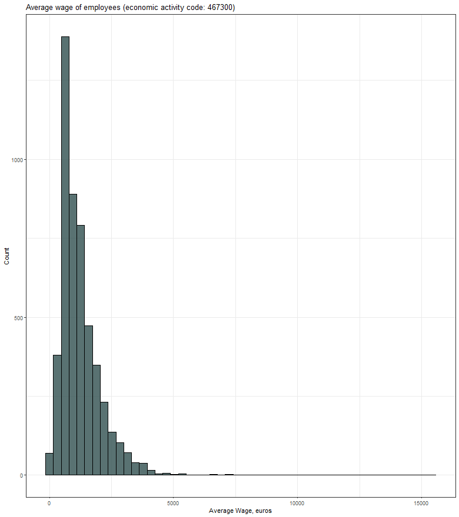
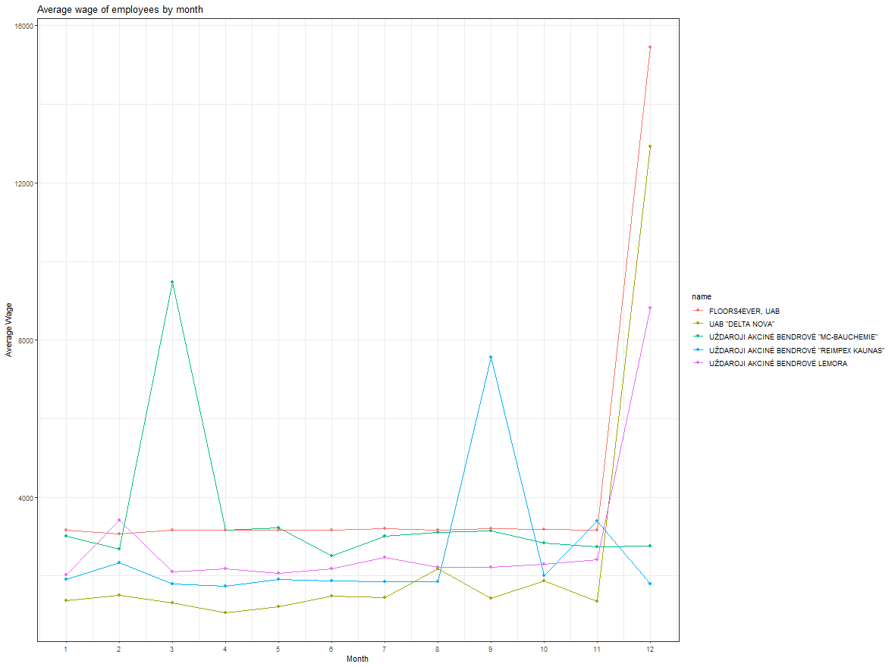
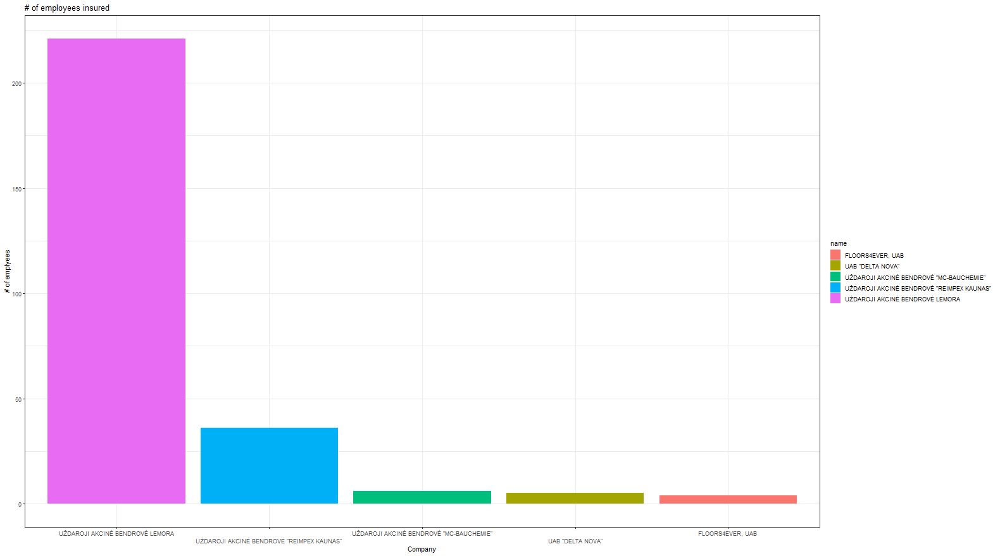
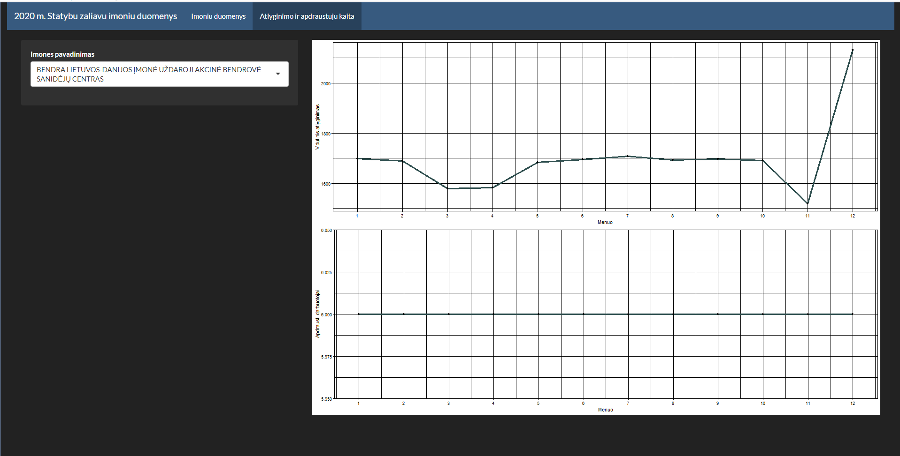

# R Laboratorinis darbas: duomenų vizualizacija

| Variantas | ecoActCode |
|------------- | ------------- |
|10   | 467300	|

### 1. Užduotis

Atsakymas:

Išvados:

### 2. Užduotis

Atsakymas:

Išvados:
Galimos prielaidos: MC-Bauchemie moka premijas per pirmą ketvirtį,Reimpex per 3 ketvirtį, likusios moka metų gale.
Floors4ever moka stabiliausią algą, bei išmoka didžiausius bonusus.

### 3. Užduotis

Atsakymas:

Išvados:
Floors4ever yra stipriai daugiau išsivystę, negu likusi rinka, atsižvelgiant į darbuotojų skaičių.

### 4. Užduotis

Shiny R aplikacijos nuotrauka:

